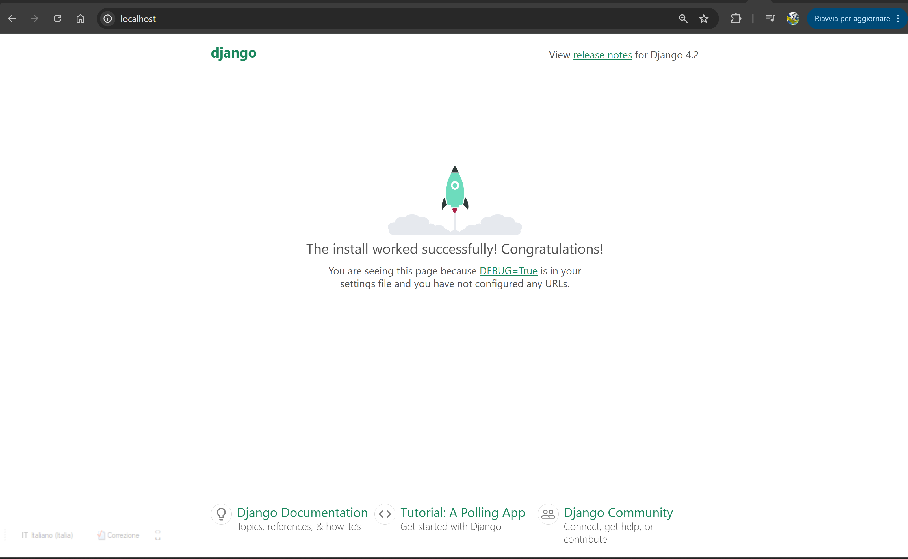

# Dockerized Django + PostgreSQL + Nginx 

Практичне завдання з автоматизації та контейнеризації трирівневої архітектури (Web-додаток, база даних та веб-сервер) за допомогою Docker та Docker Compose.

## Запуск

### 1. Налаштування оточення

Перед запуском переконайтеся, що файл `.env` створено у корінь папки `docker` на основі шаблону:

```bash
cp .env.example .env
```

### 2. Запуск контейнерів

Запустіть збірку та розгортання інфраструктури у фоновому режимі:

```bash
docker-compose -f dockers-compose.yml up -d --build
```

### 3. Застосування міграцій бази даних

Створіть таблиці в базі даних PostgreSQL:

```bash
docker-compose -f dockers-compose.yml exec django python manage.py migrate
```

##  Перевірка роботи

Веб-додаток проксирується через Nginx і доступний у браузері за адресою:
👉 [**http://localhost**](http://localhost)

## 📸 Результат роботи


