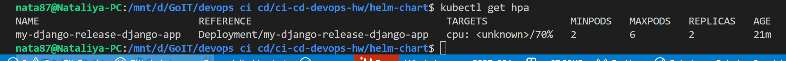
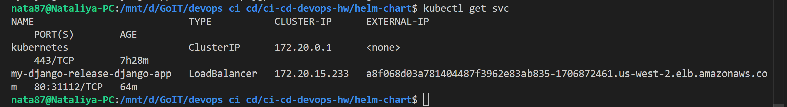
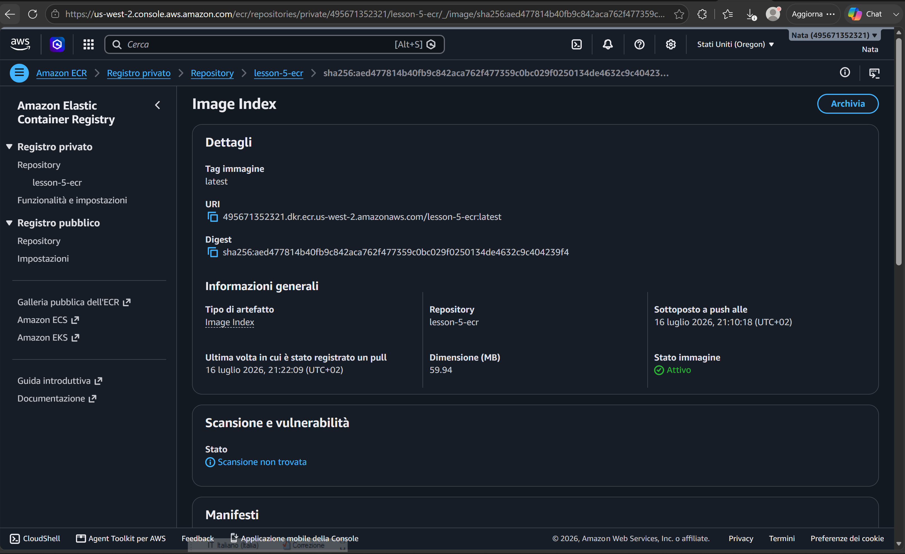
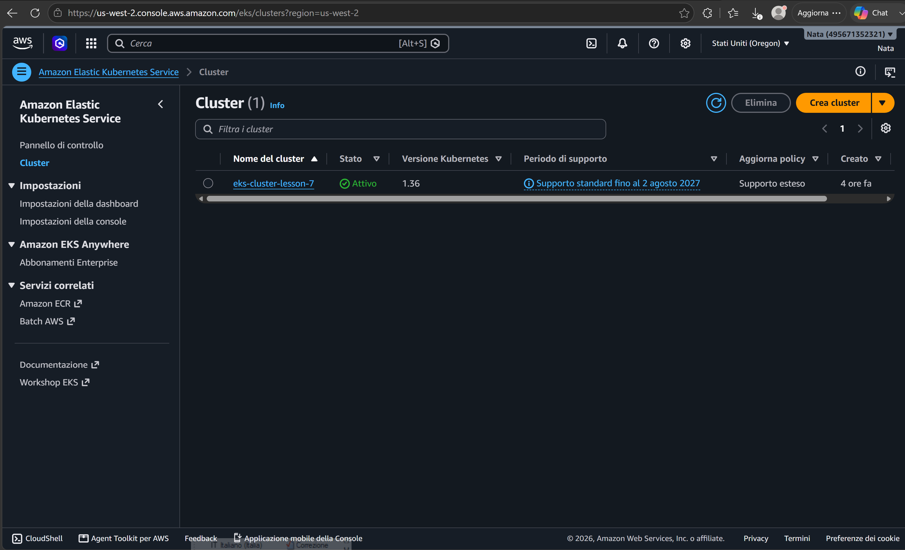

# 🚀 Домашнє завдання 7: EKS, ECR та Helm

Цей проект демонструє розгортання Django-застосунку в AWS EKS за допомогою інфраструктури як коду (Terraform) та менеджера пакетів (Helm).

## 🛠 Технології
* **Cloud:** AWS (VPC, ECR, EKS)
* **IaC:** Terraform
* **Orchestration:** Kubernetes (EKS)
* **Package Management:** Helm
* **Scaling:** Horizontal Pod Autoscaler (HPA)


##  Як запустити проект

### 1. Ініціалізація та розгортання інфраструктури (Terraform)
Перейдіть у папку з проєктом та розгорніть кластер:

```bash
cd lesson-7
terraform init
terraform apply -auto-approve
```

### 2. Розгортання застосунку (Helm)
Встановіть або оновіть реліз у кластері:

Bash
```bash
helm upgrade --install my-django-release ./charts/django-app \
  --set env.POSTGRES_PASSWORD=ваш_пароль
```
## Перевірка статусу
Перевірка подів:
```bash
kubectl get pods
```
Перевірка автоскалера:
```bash
kubectl get hpa
```
Перевірка сервісу:kubectl get svc
```bash
kubectl kubectl get svc
```

### Результат

 |
 |
 |
 |
