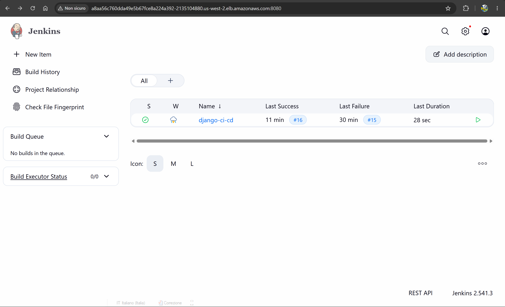
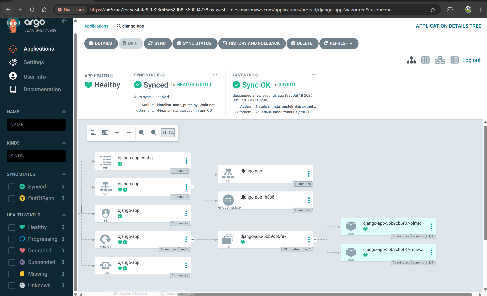

#  Домашнє завдання 8-9 Django CI/CD Pipeline
Цей проект демонструє повністю автоматизований процес CI/CD для Django-застосунку з використанням Jenkins, Kaniko, AWS ECR та Helm.

##  Технологічний стек
CI/CD: Jenkins (у Kubernetes кластері).

Containerization: Docker, Kaniko (для безпечної збірки без прав root).

Registry: AWS Elastic Container Registry (ECR).

Deployment: Helm charts.

Version Control: GitHub.

##  Як працює пайплайн
Пайплайн складається з наступних етапів:

Build & Push Docker Image:

Jenkins ініціює збірку в Kubernetes-поді за допомогою Kaniko.

Образ будується на основі Dockerfile з папки docker/django_app/.

Готовий образ автоматично завантажується в AWS ECR з унікальним тегом (номер білду).

Update Manifest:

Jenkins автоматично оновлює тег образу у файлі helm-chart/django-app/values.yaml.

Виконані зміни автоматично комітяться та пушаться назад у репозиторій Git (GitOps підхід).

##  Налаштування
Передумови
Kubernetes кластер з розгорнутим Jenkins.

IAM користувач AWS з правами AmazonEC2ContainerRegistryPowerUser.

Налаштовані Credentials у Jenkins:

AWS_ACCESS_KEY_ID / AWS_SECRET_ACCESS_KEY (для ECR).

GIT_TOKEN (для доступу до репозиторію).

Використання
Пайплайн запускається автоматично при кожному push у гілку main

##  Структура репозиторію
docker/django_app/ — Dockerfile та вихідний код застосунку.

helm-chart/django-app/ — Helm чарти для деплою.

Jenkinsfile — опис CI/CD процесу.

## Результати роботи

### 1. Jenkins з успішно завершеним останнім білдом проєкту django-ci-cd

### 2. дашборд Argo CD, який показує, що застосунок django-app успішно синхронізований та перебуває у стані "Healthy".

