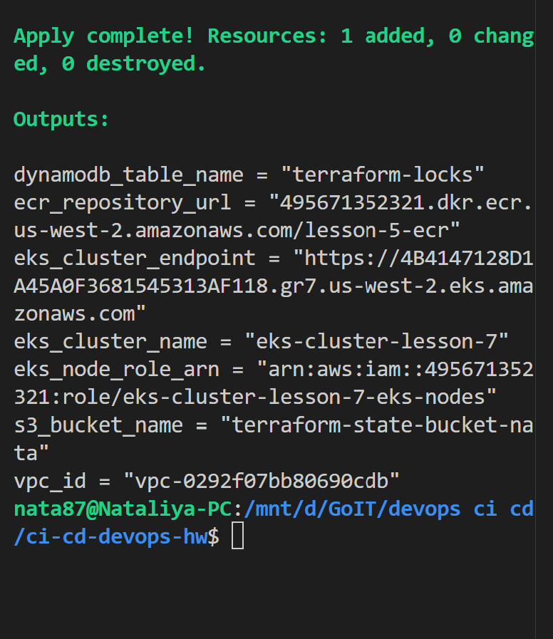
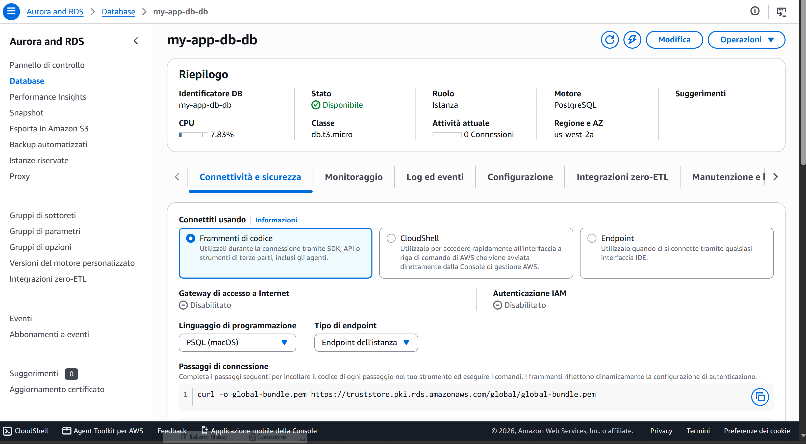

# Домашнє завдання 10: Створення гнучкого Terraform-модуля для баз даних

Цей проект містить Terraform-модуль для розгортання баз даних в AWS. Модуль підтримує як класичний Amazon RDS (PostgreSQL), так і масштабований кластер Amazon Aurora.

## Вимоги до домашнього завдання
У межах виконання завдання було реалізовано:

- **Універсальний модуль**: Створено модуль `modules/rds`, який дозволяє керувати різними типами БД.
- **Гнучкість (Conditional Logic)**: Використано параметр `use_aurora` (тип `bool`) для перемикання між RDS та Aurora через мета-аргумент `count`.
- **Налаштування мережі**: Створено `aws_db_subnet_group` та `aws_security_group` з підтримкою правил доступу.
- **Параметризація**: Реалізовано гнучке налаштування бази даних через динамічні блоки `parameter`.
- **Best Practices**: Розділено логіку на окремі файли (`shared.tf`, `rds.tf`, `aurora.tf`, `variables.tf`, `outputs.tf`).
- **Масштабованість**: Налаштовано підтримку реплік для кластера Aurora.

### Структура модуля
- `aurora.tf`: логіка створення Aurora кластера.
- `rds.tf`: логіка створення звичайного RDS інстансу.
- `shared.tf`: спільні ресурси (Subnet Group, Security Group).
- `variables.tf`: оголошення вхідних змінних.
- `outputs.tf`: виводи для отримання endpoint бази даних.

### Команди для роботи
1. Ініціалізація модуля:
   `terraform init`
2. Перевірка плану:
   `terraform plan`
3. Застосування конфігурації:
   `terraform apply`

### Результат

